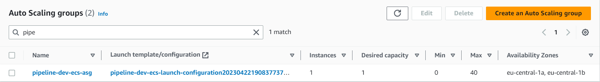
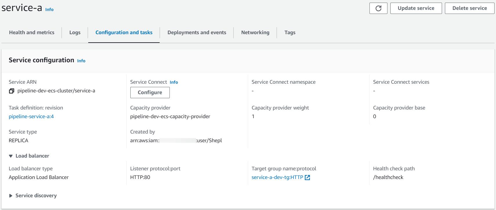

# AWS ECS Pipeline
Introducing a full deployment cycle of 2 different node.js apps with ECS cluster and Jenkins. each app will provide 2 different microservices. this cycle will aim to provide the best high availability and security to the microservices, a smart logic for dynamically scaling up / down according to changes in demand and providing optimized cost plan. using AWS stack like Cloudwatch for getting the applications logs, Route 53 bounded with ALB for routing the traffic to the cluster, and ECR for storing the images.

# Terraform Resources

- I tried to make a general ECS module including the both `EC2` and `Fargate` launch types. each launch type is prepared with auto-scaling policies and high availability across availability zones. and each launch type will have a specific target group type and different service configurations.
- Modules :
    - `Network` 
        - VPC with 2 public subnets for Loadbalancer and 2 private subnets associated with nat gateway allocated with elastic IP to make sure that apps in the private subnet can access the internet without problems.
    - `IAM`
        - 2 required services are wanted with assume role action for running the ECS services, in my case because this module will have both service launch types:
            - `Fargate` - will need `ecs-tasks.amazonaws.com` service attached to a role have a policy for managing ECS tasks and this role will be added to the Fargate service.
            - `EC2` - will need `ec2.amazonaws.com` service attached to a role that has a policy for managing ECS tasks and this role will be added to the IAM instance profile resource so we can use it on launch configuration so any launched instance will have this role assigned with it to be able to manage ECS operations.
    - `ECR`
        - For storing our images privately.
    - `ECS`
        - ECS Cluster with both service launch type solutions if Fargate or EC2.
        - security group for services and auto scaling group allows traffic only from the load balancer with an additional option allowing to access service from public IP.
        - launch Configuration configured with AMI has Docker engine installed, instance type, security group for services, and IAM instance profile important to assign an ECS task management role for each launched instance so that instance will be able to manage the ECS tasks.
        - auto-scaling group assigned with the previous launch configuration with some additional configs like target group, max & min number of launched instances.
        - Cloudwatch for creating several groups for each service for getting the container logs.
        - task definition will have a specific config according to each service case, setting each service with Cloudwatch group, the ability to choose service type if Fargate or ec2.
        - service template with launch type option configured with the previous task definition and have 2 resources, the capacity provider will be created & assigned for any service with EC2 launch type only and it's required for the best cost plan so only launched instances will be those which required by the service only and for making sure that no any unused instances are active. if Fargate then the second resource network configuration will be applied. the load balancer resource for both service types for adding each service to its specific target group with the container name & port.
        - auto-scaling target configured with 2 policies:
            - `Memory` & `CPU` - both will watch the service memory and ram metrics. if it is more than 75 % then a new replica will be launched to handle the traffic and when it goes less than 75% it will dynamically terminate the additional replica and keep only one.
            - this is very important for dynamically scaling up / down according to the traffic being handled by a service and for making sure about high availability for each service also for keeping the best cost optimization plan.
    - `Security Group`
        - creates a security group for the application load balancer opened on port 80.
    - `Alb`
        - creates an Application load balancer with all its components.
        - the alb will be published across the public subnets.
        - target group will be created for each service defined with a different target group type for each service type. so if Fargate, then it will create a target group with IP type, if EC2, it will create a target group with instance type. and the ability to configure special health check configurations for each service.
        - listener with default action response with a simple msg if the user visited a page with an unknown path pattern defined.
        - listener rules to configure for each service rules like what kind of action will be used and with which condition. here I used forward action to forward the traffic to each service target group and the condition will be if it matches a specific path pattern according to each service case.
    - `Route53`
        - for creating a custom record type A and binding it to the load balancer.
        - because I have a predefined hosted zone I just used a data resource with the hosted zone name to get the hosted zone ID which is required to add the record to it.
    - `S3`
        - to store the Terraform State.

# Application
- I made a simple node.js app to simulate the routing with a path pattern idea.
- my idea is to have 2 applications each one will have 2 different services and each service will be called by a different path pattern.
- each service will be configured with variables that will provide some details about the service such as the launch type of each service, service name, node env, and service port.
- `Service A` - will have `Medical` and `Security` services.
- `Service B` - will have `Finance` and `Payment` services.
- each service will have a custom path will be configured for the target group to simulate the health check idea.
- each service can read its values during the service update process from a JSON file as a try to let everything dynamically changeable from the pipeline.

# Installation
- The infrastructure will serve 2 services. each service will be configured with a custom launch type, variables, capacity, replica count, target groups, and auto-scaling policies.
- `Service A` - will be launched with EC2 launch type and will be listened to on port 5000 and registered on Instance target group, it will have the Medical and Security services.
- `Service B` - will be launched with Fargate launch type and will be listened to on port 5001 and registered on IP target group, it will have the Payment and Finance services.
- I made a default config for the health check that will be applied in case we do not want to set a custom config like health threshold, unhealthy threshold, timeout, or interval. these options are very important sometimes in case the application needs more time to be up and running, we will need to determine and configure the right time so that the health check can consider the service as healthy.

- Network

- Cluster

- Service A - EC2 service

- Service B - Fargate service

- CloudWatch

- Loadbalancer

- Route53

- ECR

# Jenkins pipeline

- I prepared 2 pipelines, each pipeline configured to build an image from a specific service folder and read the config file of each service so that the pipeline can read the service values and then apply them during the service update.
- because I use Kubernetes, I configured the pipeline to create a Kubernetes agent that has aws-cil and docker commands.
- both pipelines of each service will have the same process, for example, I will pick the service B pipeline and demonstrate it.

- The stages consist of 3 stages.

    - `Stage 1` - it will build & tag the docker image for each service.
   
    

    - `Stage 2` - using the AWS credentials, it will retrieve an authentication token and authenticate my Docker client to each registry then push the Docker image to each service registry.
   
    
    
    - `Stage 3` - once the new image has been built, it will be necessary to update the service with the new tag of the image. this stage will make several operations to update a service:
        - `step 1` - using JQ tool, it will read each defined variable from the dedicated JSON file.
    
        - `step 2` - to create a new updated task definition, we need the current task definition template. this step will pull the current task definition of a dedicated service and store it on a variable.
    
        - `step 3` - after catching up a task definition template, we want to deregister the currently running task definition because we will release a new one. to perform this we need to know the current running task ARN and then fetch the task definition attached to it. this will make sure that we deregistered the currently running task definition.
    
        - `step 4` - using the first variable created in the second step, we will release a new task definition with some updates, this step will echo the task definition template and update it with the new image tag and values of the variables defined in the first step then delete some unwanted keys related to the old task definition revision. I used JQ tool because we are editing on JSON file format so this is the best option that could be used in my case to make sure that no syntax errors as it's very critical and would destroy all the steps if it appeared during the update.
        - we can see the new image tag has been updated from `latest` to `2-service-b` and a new revision number `7` has been added.
    
        - `step 5` - after the new updated task definition is created, we must register it to the task definition section of the service.
    
        - `step 6` - this step will get the new revision number of the new task definition which was registered in the previous step then update the service with the new task definition : revision number.
    

- and the same update process for Service A :

